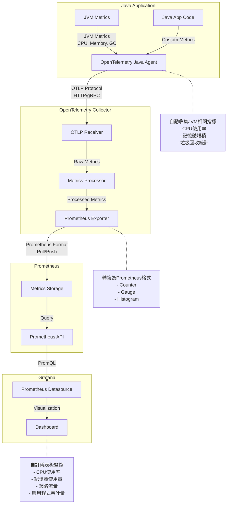

# 本地 Kubernetes 監控堆疊

## 🏗️ 架構概覽



## 📊 監控組件說明

### 1. **Demo App (你的應用程式)**
- **OpenTelemetry Java Agent**: 自動收集 JVM 指標
- **Spring Boot Actuator**: 提供 `/actuator/prometheus` 端點
- **自定義指標**: 業務邏輯相關的指標

Java Spring Boot 應用程式中 Prometheus 的四種主要 Metrics 類型的完整實作指南

四種 Metrics 類型：
Counter（計數器） - 只能增加的累積指標，用於計算請求次數、錯誤數等
Gauge（儀表） - 可上下變動的瞬時值，用於記憶體使用量、連接數等
Histogram（直方圖） - 測量值的分布，提供桶計數和分位數，適合回應時間統計
Summary（摘要） - 類似 Histogram，但在客戶端計算分位數，適合延遲測量

訪問 curl http://localhost:8081/actuator/prometheus 可以看到所有 metrics，常用查詢：

Counter: http_requests_total
Gauge: jvm_memory_used_bytes
Histogram: http_request_duration_seconds_bucket
Summary: api_response_time{quantile="0.95"}


### 2. **OpenTelemetry Collector**
- **Prometheus Receiver**: 從 demo-app 抓取指標
- **Prometheus Exporter**: 重新暴露指標給 Prometheus
- **資料處理**: 添加標籤、批次處理等

### 3. **Prometheus Server**
- **指標收集**: 從多個來源抓取指標
- **時間序列資料庫**: 儲存歷史指標資料
- **查詢引擎**: 支援 PromQL 查詢語言

### 4. **Grafana**
- **視覺化**: 圖表、儀表板、告警
- **預設 Dashboard**: JVM、Spring Boot、Kubernetes
- **自定義 Dashboard**: 專門為 demo-app 設計

## 🚀 快速部署

### 一鍵安裝
```bash
./tmp_rovodev_setup_local_monitoring.sh
```

### 手動安裝步驟
```bash
# 1. 安裝監控堆疊
chmod +x k8s/monitoring/install-monitoring.sh
./k8s/monitoring/install-monitoring.sh

# 2. 安裝 ServiceMonitor
kubectl apply -f k8s/monitoring/demo-app-servicemonitor.yaml

# 3. 啟用 OTel Collector
kubectl patch application demo-app -n argocd --type='merge' -p='{
  "spec": {
    "source": {
      "helm": {
        "parameters": [
          {"name": "otelCollector.enabled", "value": "true"},
          {"name": "otelCollector.backend", "value": "local"}
        ]
      }
    }
  }
}'
```

## 🔍 訪問方式

### Grafana (主要視覺化介面)
```bash
kubectl port-forward -n monitoring svc/prometheus-grafana 3000:80
```
- URL: http://localhost:3000
- 用戶名: `admin`
- 密碼: `admin123`


go to connections -> datasources
http://prometheus-kube-prometheus-prometheus.monitoring.svc.cluster.local:9090


### Prometheus (指標查詢)
```bash
kubectl port-forward -n monitoring svc/prometheus-kube-prometheus-prometheus 9090:9090
```
- URL: http://localhost:9090

### Demo App 指標端點
```bash
kubectl port-forward -n demo-app svc/demo-app 8080:8080
```
- URL: http://localhost:8080/actuator/prometheus

## 📈 預設 Dashboard

安裝後會自動導入以下 Dashboard：

1. **JVM Dashboard (ID: 4701)**
   - JVM 記憶體使用量
   - 垃圾回收統計
   - 執行緒狀態

2. **Spring Boot Dashboard (ID: 6756)**
   - HTTP 請求統計
   - 應用程式健康狀態
   - 自定義指標

3. **Kubernetes Dashboard (ID: 315)**
   - 集群資源使用量
   - Pod 狀態
   - 節點監控

## 🔧 自定義配置

### 修改 Prometheus 配置
編輯 `k8s/monitoring/prometheus-values.yaml`

### 添加新的 Dashboard
1. 在 Grafana 中創建 Dashboard
2. 導出 JSON 配置
3. 添加到 `prometheus-values.yaml` 的 `dashboards` 區段

### 配置告警規則
在 `prometheus-values.yaml` 中添加 `additionalPrometheusRulesMap`

## 🛠️ 故障排除

### 檢查 Pod 狀態
```bash
kubectl get pods -n monitoring
kubectl get pods -n demo-app
```

### 檢查服務發現
```bash
kubectl get servicemonitor -n monitoring
```

### 查看 Prometheus 目標
在 Prometheus UI 中訪問 Status > Targets

### 檢查指標是否正常
```bash
curl http://localhost:8080/actuator/prometheus | grep jvm_memory
```

## 📊 重要指標說明

### JVM 指標
- `jvm_memory_used_bytes`: JVM 記憶體使用量
- `jvm_gc_pause_seconds`: GC 暫停時間
- `jvm_threads_live_threads`: 活躍執行緒數
- `process_cpu_usage`: CPU 使用率

### 應用程式指標
- `http_server_requests_seconds`: HTTP 請求統計
- `demo_app_post_operations_total`: 自定義業務指標
- `demo_app_file_operations_total`: 檔案操作指標

### 系統指標
- `node_cpu_seconds_total`: 節點 CPU 使用量
- `node_memory_MemAvailable_bytes`: 可用記憶體
- `kube_pod_status_phase`: Pod 狀態